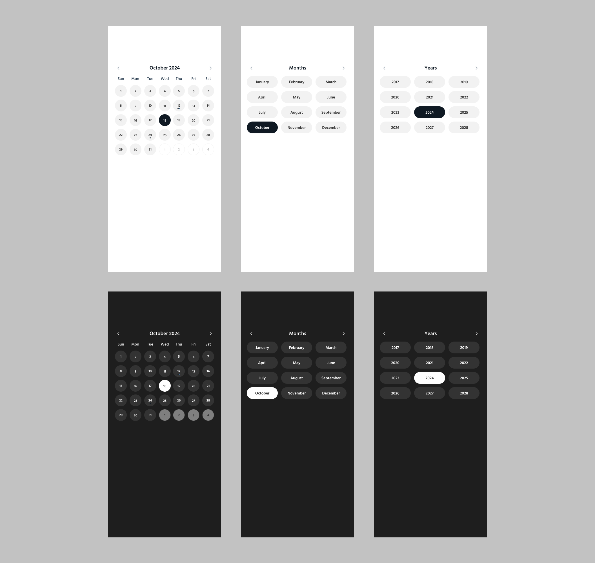

# React Modern Calendar

This project is a simple, interactive **Calendar Selection Component** built with **React** and **TypeScript**. The component allows users to select a specific day from a calendar, which can be useful for applications requiring date-based selection such as booking systems, event scheduling, or personal planners.

## Project Overview

The `Calendar` component provides an intuitive UI where users can:

- **View the current month**: The calendar will display the current month, and users can click on any day.
- **Select a date**: When a day is clicked, the selected date is highlighted.
- **Highlight today's date**: The current day is highlighted in blue to differentiate it from the other days.
- **Highlight selected day**: Once a user selects a day, it will be highlighted in green.
- **React on date selection**: The selected date is passed back to the parent component.

## Features

- **Date Formatting**: Dates are formatted as `YYYY-MM-DD` to ensure uniformity.
- **Highlighting**: Current date is marked with a different background color.
- **Selection Feedback**: When a user selects a day, it is highlighted in a different color for clear feedback.
- **Responsive Design**: The calendar adjusts its layout to fit various screen sizes.

## Setup and Installation

1. **Clone the repository**:

```bash
git clone https://github.com/your-username/calendar-selection-component.git
```

2. **Install dependencies**:
   Navigate to the project folder and install the required dependencies:

```bash
cd calendar-selection-component
npm install
```

3. **Run the project**:
   To start the development server:

```bash
npm start
```

4. **Open your browser**:
   Navigate to `http://localhost:3000` to see the application in action.

## Usage

To use the calendar component in your React application, follow these steps:

1. Import the `Calendar` component in your React component:

```tsx
import Calendar from "./components/Calendar";
```

2. Use the `Calendar` component and provide the necessary props for `selectedDate` and `onSelectDate`:

```tsx
import { useState } from "react";
import Calendar from "./components/Calendar";

function App() {
  const [selectedDate, setSelectedDate] = useState<string | null>(
    null
  );

  const handleSelectedDate = (date: string) => {
    setSelectedDate(date); // Handle selected date here
  };

  return (
    <div className="App">
      <Calendar
        selectedDate={selectedDate}
        onSelectDate={handleSelectedDate}
      />
    </div>
  );
}

export default App;
```

3. The calendar will automatically update and highlight the selected day when a user clicks on a day.

## UI Design Goals

The following is the UI design goal for the Calendar component:

- **Current Month Display**: The calendar should display the days of the current month with the correct number of days.
- **Selectable Days**: Days should be clickable, and when clicked, the selected day should be highlighted.
- **Highlighting Today's Date**: The current date should be highlighted in a distinct color (e.g., blue).
- **Selected Day Styling**: Once a user selects a day, it should be highlighted in green to provide feedback.
- **Simple and Clear Layout**: The layout should be simple, with a clean design that focuses on ease of use.

### Screenshot of the UI:

Here is a mockup of the UI that this project is aiming to achieve:



## Tech Stack

- **React**: JavaScript library for building user interfaces.
- **TypeScript**: A superset of JavaScript that adds static typing.
- **Day.js**: Lightweight date library for parsing, validating, manipulating, and displaying dates.
- **StyleX**: The styling system that powers facebook.com

## Soon Available on npm!

We are working on publishing this component to npm, so it will be easy to install and use in your React projects. Stay tuned for the official release!

## TODO's

- [ ] Rename it because it's not limited to React

## License

This project is open-source and available under the [MIT License](LICENSE).
